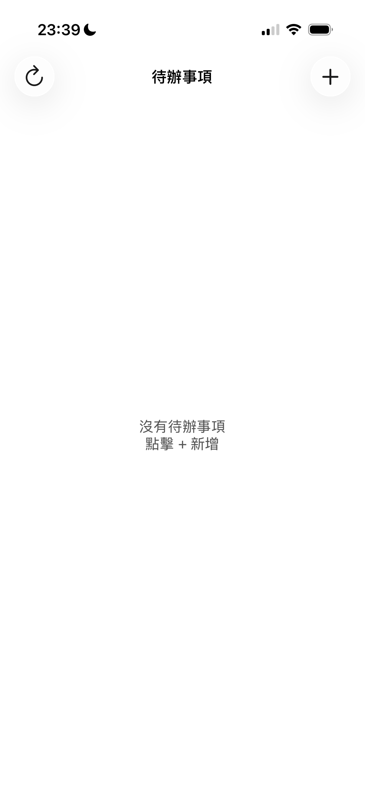
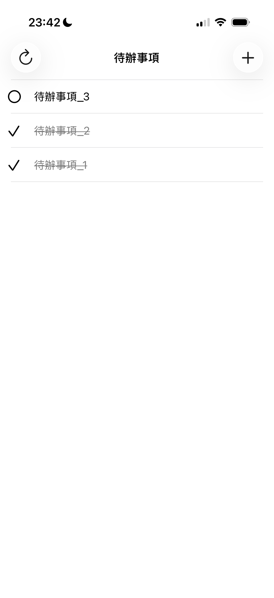
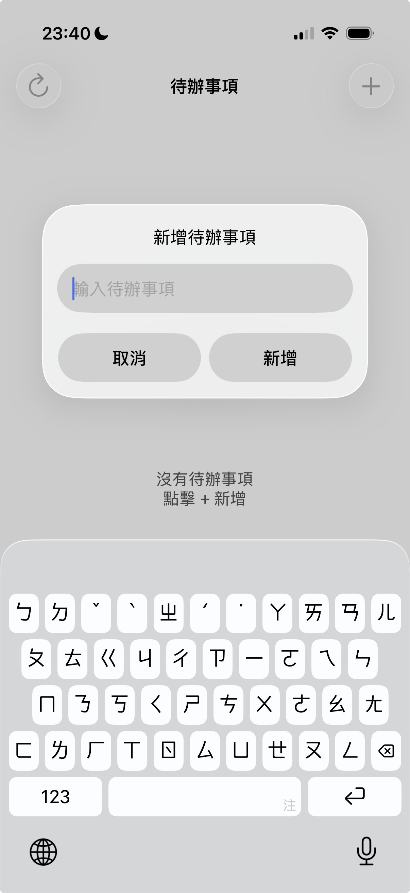

# Todo App - Firebase + MVVM 📝

> 一個展現 iOS 開發與架構能力的待辦事項 App，採用 MVVM 架構與本地優先同步策略

[](https://swift.org)
[](https://www.apple.com/ios)
[](LICENSE)

---

## 📱 App 截圖

<p align="center">
  
  
  
</p>

<p align="center">
  <em>左：空白狀態 | 中：待辦事項列表 | 右：新增待辦事項</em>
</p>

---

## ✨ 專案亮點

### 核心特色

- ✅ **MVVM 架構** - 清晰的職責分離，易於測試和維護
- ✅ **本地優先策略** - 立即響應用戶操作，背景同步雲端
- ✅ **完整離線支援** - 完全可離線使用，網路恢復時自動同步
- ✅ **智能去重機制** - 用 clientId 追蹤，防止重複上傳
- ✅ **樂觀更新 (Optimistic UI)** - 立即 UI 反饋，極佳用戶體驗
- ✅ **上傳狀態管理** - isUploading 標記，防止重複操作

### 技術亮點

- 🎯 **雙 ID 系統**：Firebase Document ID + Client UUID
- 🔄 **自動衝突解決**：本地與雲端資料智能合併
- 💾 **雙寫機制**：UserDefaults + Firebase 同步儲存
- 🔌 **完整錯誤處理**：網路失敗自動重試
- 🧹 **記憶體管理**：[weak self] 避免循環參考

---

## 🏗️ 架構設計

### MVVM 模式
```
View (TodoListViewController)
  ↓ User Actions
  ↓ Closure Binding
ViewModel (TodoListViewModel)
  ↓ Business Logic
  ↓ Data Management
Service (TodoService)
  ↓ Network Layer
  ↓ API Calls
Firebase Firestore
```

**職責分離：**
- **View**: UI 顯示與用戶互動（150 行）
- **ViewModel**: 業務邏輯與資料處理（280 行）
- **Service**: 網路請求與 Firebase 操作（120 行）
- **Model**: 資料結構定義（80 行）

---

## 🔄 資料流與同步策略

### 本地優先策略
```
用戶操作 → 立即更新本地 (0.01s) → UI 立即刷新 ✓
              ↓
         背景同步雲端 (1-2s)
              ↓
         成功：完成
         失敗：保留本地，自動重試
```

**為什麼選擇本地優先？**

1. **用戶體驗優先**：立即反應 vs 等待 1-2 秒
2. **離線完全可用**：地鐵、飛機上也能使用
3. **業界標準**：Todoist、Notion、Google Keep 都用本地優先
4. **適合場景**：Todo App 不需要即時一致性

---

### 完整同步流程

#### 新增待辦事項
```
離線時：
────────────────────────
1. 建立 Todo
   id: temp_uuid
   clientId: uuid
   isUploading: true
   
2. 立即存本地 ✓
3. UI 立即顯示 ✓

4. 嘗試上傳
   成功 → 替換 temp_id 為 cloud_id
   失敗 → 保留本地，isUploading: false

────────────────────────

上線後：
────────────────────────
5. syncFromCloud() 觸發
6. uploadLocalOnlyTodos() 找到 temp_id 項目
7. 上傳到 Firebase（用 clientId 作為 document ID）
8. 收到 cloud_id
9. 本地替換 temp_id

10. 如果上傳時 completed 狀態不同
    → 額外呼叫 setTodoCompleted 同步
```

#### Toggle 待辦事項
```
離線時：
────────────────────────
1. 本地立即 toggle ✓
2. 更新 updatedAt ✓
3. 儲存本地 ✓
4. UI 立即更新 ✓

5. 如果是 temp_id
   → 只更新本地，等待上傳

6. 如果有 cloud_id
   → 嘗試同步
   → 失敗保留本地

────────────────────────

上線後：
────────────────────────
7. 如果是 temp_id
   → uploadLocalOnlyTodos 會包含最新狀態

8. 如果有 cloud_id
   → setTodoCompleted 同步狀態
```

---

### 去重機制
```swift
// 用 clientId 分組，選 updatedAt 最新的
let deduped = Dictionary(grouping: combined, by: { $0.clientId })
  .compactMap { (_, items) in
    items.max(by: { $0.updatedAt < $1.updatedAt })
  }
```

**為什麼需要去重？**

- 離線時可能多次操作同一項目
- 網路不穩定可能重複上傳
- clientId 確保每個項目唯一

**關鍵設計：用 clientId 作為 Firebase Document ID**
```swift
// TodoService.swift
let docRef = endpoint.collectionRef.document(todo.clientId)
```

**優點：**
- 相同 clientId 不會建立多個 document
- Firebase 自動去重
- 簡化同步邏輯

---

### 上傳狀態管理
```swift
struct Todo {
    var isUploading: Bool = false  // 防止重複上傳
}
```

**防止重複上傳：**
```swift
// 只上傳未在上傳中的項目
let localOnlyTodos = todos.filter { $0.hasTempId && !$0.isUploading }
```

**狀態流轉：**
```
新增時：isUploading = true
上傳成功：isUploading = false（替換為 cloud todo）
上傳失敗：isUploading = false（保留 temp_id）
```

---

## 📂 專案結構
```
TodoApp/
├── Controllers/
│   └── TodoListViewController.swift      # UI 邏輯（150 行）
├── ViewModels/
│   └── TodoListViewModel.swift           # 業務邏輯（280 行）
├── Models/
│   └── Todo.swift                        # 資料模型（80 行）
├── Services/
│   └── Networking/
│    |   ├── NetworkError.swift            # 錯誤定義
│    |   ├── FirebaseEndpoint.swift        # 路徑管理
│    └── TodoService.swift                 # Firebase CRUD（120 行）
├── Storage/
│   └── LocalStorageManager.swift         # UserDefaults 儲存
├── Views/
│   ├── Main.storyboard                   # 主畫面
│   ├── TodoCell.swift                    # 自定義 Cell
│   └── TodoCell.xib                      # Cell 介面
└── Supporting Files/
    ├── AppDelegate.swift
    └── GoogleService-Info.plist
```

---

## 🎯 技術亮點

### iOS 開發

**UIKit**
- UITableView 完整實作
- 自定義 XIB Cell
- UIRefreshControl 下拉重新整理
- Storyboard 介面設計

**架構模式**
- MVVM 完整實作
- Service Layer 分層
- Repository Pattern 資料存取
- Closure-based Binding

**資料處理**
- UserDefaults 本地儲存
- Codable 序列化
- 去重演算法（Dictionary grouping）
- 資料合併策略

**非同步處理**
- GCD / DispatchQueue
- Completion Handlers
- 非同步資料流控制

**記憶體管理**
- [weak self] 避免循環參考
- ARC 自動記憶體管理
- Closure 記憶體管理

---

### Firebase

**Firestore**
- Document/Collection 結構
- CRUD 完整操作
- 用 clientId 作為 Document ID（防重複）
- Timestamp 時間處理
- 錯誤處理封裝

**同步策略**
- 離線快取
- 自動重試
- 衝突解決

---

### 軟體工程

**版本控制**
- Git flow
- 清楚的 Commit History
- 有意義的 Commit Message

**程式碼品質**
- 職責單一原則
- 高可測試性
- 可維護性
- 完整註解

**用戶體驗**
- 本地優先策略
- 離線完全支援
- 樂觀更新
- 錯誤處理

---


## 📚 核心功能說明

### 雙 ID 系統
```swift
struct Todo {
    var id: String?        // Firebase Document ID
    var clientId: String   // Client UUID
    // ...
}
```

**為什麼需要兩個 ID？**

| ID 類型 | 用途 | 特性 |
|--------|------|------|
| id | Firebase CRUD 操作 | Firebase 生成，可能是 temp_xxx 或 cloud_id |
| clientId | 去重與追蹤 | 客戶端生成，永不改變，作為 Firebase Document ID |

**實際應用：**
```swift
// 防止重複上傳：用 clientId 作為 Document ID
let docRef = endpoint.collectionRef.document(todo.clientId)

// Toggle 操作：用 id
todoService.setTodoCompleted(id: id, completed: true)

// 去重合併：用 clientId
Dictionary(grouping: todos, by: { $0.clientId })

// 替換本地項目：用 clientId 匹配
todos.firstIndex(where: { $0.clientId == serverTodo.clientId })
```

---

### 臨時 ID 機制
```swift
static func createWithTempId(title: String) -> Todo {
    let uuidStr = UUID().uuidString
    return Todo(
        id: "temp_\(uuidStr)",      // 臨時 ID
        clientId: uuidStr,           // 永久 ID
        // ...
    )
}

var hasTempId: Bool { 
    id?.hasPrefix("temp_") ?? false 
}
```

**用途：**
- 識別尚未上傳的項目
- 過濾需要上傳的項目
- 判斷是否需要呼叫 Firebase API

---

### 上傳後狀態同步
```swift
// 上傳成功後的處理
case .success(var cloudTodo):
    let local = todos[index]
    
    // 保留本地的 completed 狀態（可能已 toggle）
    cloudTodo.completed = local.completed
    
    // 使用較新的 updatedAt
    cloudTodo.updatedAt = max(local.updatedAt, cloudTodo.updatedAt)
    
    // 替換本地項目
    todos[index] = cloudTodo
    
    // 如果狀態不同，額外同步
    if local.completed != cloudTodo.completed {
        todoService.setTodoCompleted(id: cloudTodo.id, completed: local.completed)
    }
```

**為什麼這樣設計？**

防止上傳過程中用戶又 toggle，導致狀態不一致

---

## 🎯 面試準備

### 架構決策

**Q: 為什麼從 MVC 重構到 MVVM？**
```
問題：
- ViewController 超過 300 行
- UI 邏輯和業務邏輯混在一起
- 難以測試

解決：
- MVVM 職責清晰：View 150 行，ViewModel 280 行
- ViewModel 可獨立測試
- 業務邏輯可重用
```

**Q: 為什麼用 Closure-based binding 而不是 Combine/RxSwift？**
```
考量：
- 專案規模小，資料流簡單
- Closure 足夠且直觀
- 不需要額外依賴
- 學習曲線低

如果專案更大，我會考慮 Combine：
- 複雜的資料流轉換
- 多個事件組合
- 響應式程式設計優勢
```

---

### 資料同步

**Q: 本地優先 vs 雲端優先的取捨？**
```
本地優先（我的選擇）：
✅ 用戶體驗極佳（立即反應）
✅ 離線完全可用
✅ 符合 Todo App 使用場景
⚠️ 需要處理同步邏輯
⚠️ 可能有短暫不一致

雲端優先（適合其他場景）：
✅ 資料絕對一致
✅ 適合金融、交易類 App
❌ 用戶體驗差
❌ 離線完全不能用

結論：
Todo App 不是關鍵資料，
用戶期待立即反應，
本地優先是最佳選擇。
```

**Q: 如何防止重複上傳？**
```
關鍵設計：

1. 用 clientId 作為 Firebase Document ID
   → 相同 clientId 不會重複建立

2. isUploading 狀態標記
   → 正在上傳的不會再次上傳

3. 去重機制
   → 合併時用 clientId 分組

效果：
完全杜絕重複上傳
```

**Q: 如何處理離線時 toggle 的狀態？**
```
流程：

1. 離線 toggle
   → 本地立即更新 completed 和 updatedAt

2. 上線後上傳
   → 上傳時包含最新的 completed 狀態

3. 如果上傳過程中又 toggle
   → 用 max(local.updatedAt, cloud.updatedAt)
   → 額外呼叫 setTodoCompleted 同步

結果：
不會丟失任何操作
```

---

### 技術細節

**Q: 為什麼需要 id 和 clientId 兩個 ID？**
```
id (Firebase Document ID)：
- Firebase CRUD 操作必需
- toggle, delete 需要這個 id
- 判斷是否已上傳（temp_ vs cloud_）

clientId (UUID)：
- 追蹤同一筆資料
- 去重（grouping by clientId）
- 作為 Firebase Document ID（防重複）
- 匹配上傳後的項目

兩者缺一不可：
id 用於 Firebase 操作
clientId 用於追蹤和去重
```

**Q: 去重邏輯如何實作？**
```swift
// 1. 用 clientId 分組
Dictionary(grouping: combined, by: { $0.clientId })

// 2. 每組選 updatedAt 最新的
.compactMap { (_, items) in
    items.max(by: { $0.updatedAt < $1.updatedAt })
}

// 3. 按 createdAt 排序
.sorted { $0.createdAt > $1.createdAt }
```

**Q: 記憶體管理注意事項？**
```
1. Closure 使用 [weak self]
   避免循環參考

2. Completion handlers 執行後釋放
   不會持續佔用記憶體

3. Binding closures 在 ViewController
   deinit 時清理

4. 用 Instruments 檢查洩漏
   確保沒有記憶體問題
```

---

## 🐛 已知限制

### 目前限制

1. **單一用戶**：沒有多用戶協作
2. **簡單去重**：只保留最新的，不保留操作歷史
3. **無離線刪除同步**：離線刪除的項目，上線後不會同步刪除雲端

### 未來改進方向

如果要支援多人協作，需要：

1. **CRDT (Conflict-free Replicated Data Type)**
   - 保證最終一致性
   - 不丟失任何操作

2. **Operational Transformation**
   - Google Docs 的做法
   - 保留操作歷史

3. **顯示衝突讓用戶選擇**
   - Git merge conflict 方式
   - 用戶手動解決

---

## 📄 License

MIT License - 詳見 [LICENSE](LICENSE) 檔案

---

## 👨‍💻 作者

**Jeffrey** - iOS Developer

- GitHub: [@jeffliuapple](https://github.com/jeffliuapple)
- 專案連結: [TodoApp](https://github.com/jeffliuapple/TodoApp)

---

## 🙏 致謝

感謝 Claude 在開發過程中的技術協助與架構建議

---

## 📝 更新日誌

### v2.0 - 2025/12/30
- ✅ 加入 isUploading 狀態管理
- ✅ 用 clientId 作為 Firebase Document ID
- ✅ 完全解決重複上傳問題
- ✅ 優化上傳後狀態同步邏輯
- ✅ 加入完整的面試準備文檔

### v1.0 - 2025/12/24
- ✅ MVVM 架構重構
- ✅ 本地儲存實作
- ✅ 離線同步機制
- ✅ 臨時 ID 追蹤
- ✅ 去重機制

---

**這是一個展現 iOS 開發能力的完整專案，隨時準備面試！** 🚀
